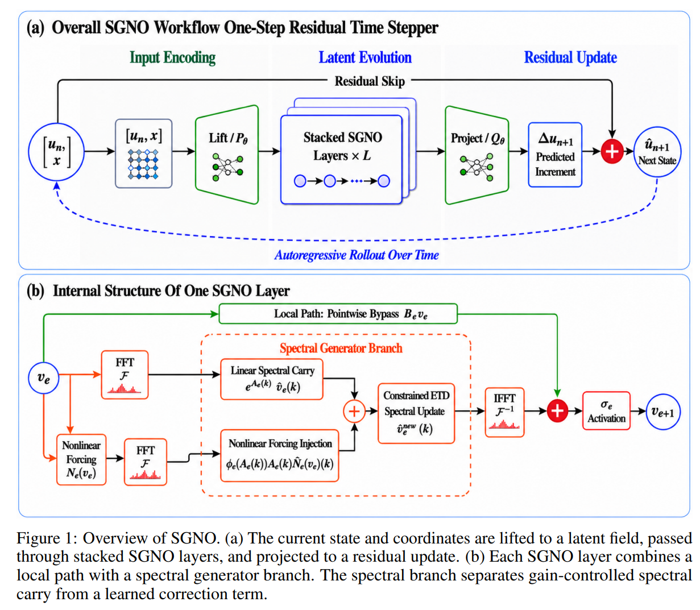

# SGNO



This repository provides a PyTorch implementation of the Spectral Generator Neural Operator for one-step supervised training and long-horizon autoregressive PDE rollouts.

SGNO maps the current state and coordinates to the next state through a residual neural operator. The state-coordinate input is lifted to a latent field, passed through stacked SGNO layers, and projected to a residual update that is added to the current state.

Each SGNO layer combines a local path with a spectral generator branch. The spectral branch separates gain-controlled spectral carry from a learned correction pathway using a real-valued nonpositive diagonal generator, complex-valued spectral mixing, and bounded injection budgets.

The implementation targets periodic linear and semilinear evolution PDEs with Fourier-structured linear dynamics.

## Repository Structure

`src/sgno` contains the model definitions and the wrapper used by the scripts.

`scripts` contains minimal training, evaluation, and sanity-check entry points.

`configs` contains canonical 1D, 2D, and 3D example settings.

`tests` contains lightweight forward and audit checks.

## Installation

Python 3.10 or newer is recommended.

```bash
pip install -r requirements.txt
pip install -e .
```

Optional test dependency:

```bash
pip install -r requirements_dev.txt
```

## Quick Check

```bash
python scripts/sanity_check.py
```

## Data Format

Training and evaluation scripts expect a NumPy NPZ file containing float32 trajectories.

Accepted keys:

```text
train and test
u
```

Layouts:

```text
1D: (N, T, C, X)
2D: (N, T, C, X, Y)
3D: (N, T, C, X, Y, Z)
```

The history length is `initial_step`. The canonical experiments use `initial_step=1`.

## Canonical Configurations

The public API exposes the canonical SGNO configuration string:

```text
sgno_canonical;width=<int>;modes=<int>;n_blocks=<int>;initial_step=<int>
```

Reference dimension-level settings:

```text
1D: sgno_canonical;width=11;modes=26;n_blocks=7;initial_step=1
2D: sgno_canonical;width=5;modes=10;n_blocks=9;initial_step=1
3D: sgno_canonical;width=10;modes=6;n_blocks=2;initial_step=1
```

## Training

One-step supervised training minimizes MSE on the next state.

```bash
python scripts/train_npz.py --config configs/example_2d.json --data path/to/data.npz --out runs/example_2d
```

The output directory contains `best.pt` and `state.json`.

## Evaluation

Autoregressive evaluation initializes from the first test frame or history window and repeatedly applies the learned one-step map.

```bash
python scripts/eval_npz.py --config configs/example_2d.json --data path/to/data.npz --ckpt runs/example_2d/best.pt --out runs/example_2d/eval.json --steps 200 --tau 0.1
```

The reported `gmean100` is computed from mean nRMSE over rollout steps 1 through 100. At each step, nRMSE is averaged across evaluated trajectories first, then the geometric mean is taken over time. By default the metric is unclipped. Set `--cap` to a positive value only when clipped diagnostics are desired.

`stable_step` is the first rollout step where the mean nRMSE exceeds `tau`. Non-finite values are treated as threshold crossings.

## Build API

```python
from sgno import build_sgno_from_config, summarize_gain_audit

model = build_sgno_from_config(
    network_config="sgno_canonical;width=5;modes=10;n_blocks=9;initial_step=1",
    num_spatial_dims=2,
    num_points=64,
    num_channels=1,
)

audit = summarize_gain_audit(model)
```

## License

MIT
